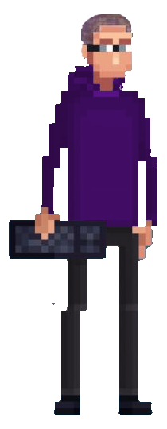

<h1> Gabriel de Oliveira Ribeiro - Desenvolvedor Fullstack </h1>

|||
|:-:|:-:|
||
Olá, prazer em ter você aqui, pode me chamar de Deori,
 
Tenho mais de 2 anos de experiência como Fullstack e atualmente sou <b>desenvolvedor</b> na <a href="https://www.linkedin.com/company/skilabs/mycompany/verification/">SkillLabs</a>. Faço engenharia de Software, faço freelances em Python e estou participando de uma Startup, mas juro que não é só isso, vem me conhecer mais...

 
 |

> Por mais que as tecnologias que escolhemos, estudamos e nos aprimoramos sejam definidoras das trajetórias que seguimos, sempre entendi que a programação não é sobre tecnologias, mas sobre pessoas e problemas.
